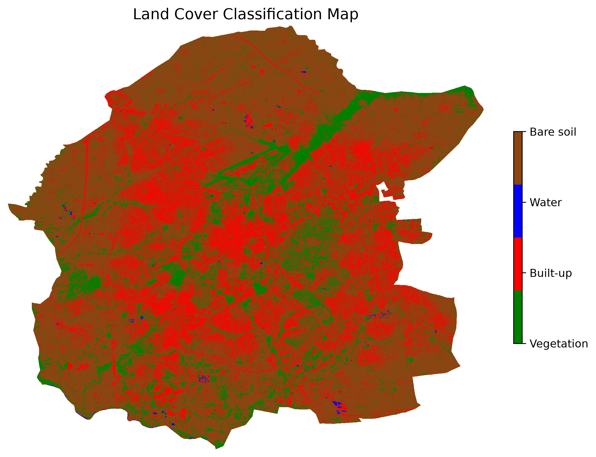
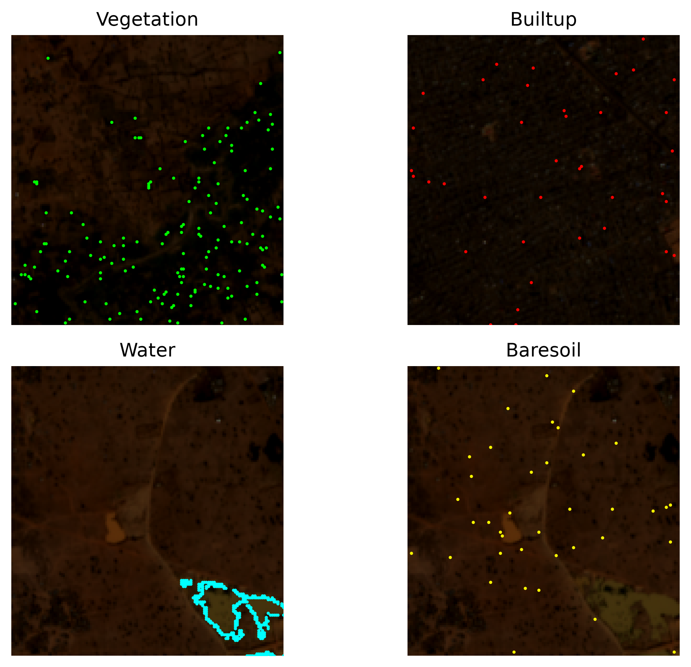

# Indices RF Classifier

A Sentinel-2 land-cover classification workflow using an intricate combination of spectral indices and a Random Forest classifier.

## Overview

This project classifies Sentinel-2 imagery into four land-cover classes: vegetation, built-up, water, and bare soil. Spectral indices are used to generate rule-based training samples, which are then used to train a Random Forest classifier for pixel-level land-cover mapping.

The workflow retrieves Sentinel-2 imagery from a STAC catalog, preprocesses and composites the imagery, generates training samples, trains the classifier, and produces land-cover maps.

The workflow supports configurable dates and areas of interest, including polygon and bounding-box AOIs in latitude/longitude coordinates.

## Repository Structure

```text
indices-rf-classifier/
├── AOI/
├── src/
│   ├── data_request.py
│   ├── preprocess.py
│   ├── features.py
│   ├── train.py
│   ├── classify.py
│   └── utils.py
├── outputs/
├── config.yaml
├── main.py
├── requirements.txt
├── README.md
└── .gitignore
```

## Setup

### Clone the repository

```bash
git clone https://github.com/alhassannh/indices-rf-classifier.git
cd indices-rf-classifier
```

### Create a virtual environment

**Windows PowerShell**

```powershell
python -m venv .venv
Set-ExecutionPolicy -Scope Process -ExecutionPolicy Bypass
.\.venv\Scripts\Activate.ps1
```

**Linux / macOS**

```bash
python -m venv .venv
source .venv/bin/activate
```

### Install dependencies

```bash
pip install -r requirements.txt
```

### Configure the workflow

Edit `config.yaml` to set the default:

- Sentinel-2 date range
- Area of interest
- Cloud-cover threshold
- Raster resolution and CRS
- Training parameters
- Classification thresholds

## Running the Workflow

The workflow is controlled through `main.py` using the `--stage` argument. Each stage can be run independently, while `--stage all` runs sample extraction, model training, and classification using the configured dataset.

### Available stages

```bash
python main.py --stage search      # Search STAC using the configured dates and AOI
python main.py --stage preprocess  # Preprocess imagery and save the composite as Zarr
python main.py --stage samples     # Extract and visualise training samples
python main.py --stage train       # Train and evaluate the Random Forest model
python main.py --stage classify    # Classify imagery and generate a land-cover map
python main.py --stage all         # Run samples, training, and classification
```

### Optional arguments

The `search`, `preprocess`, and `classify` stages accept optional date and AOI arguments. When these are not supplied, the values in `config.yaml` are used.

```bash
python main.py --stage search --start DATE --end DATE
python main.py --stage search --aoi aoi.gpkg
python main.py --stage search --aoi MIN_LON MIN_LAT MAX_LON MAX_LAT
python main.py --stage search --start DATE --end DATE --aoi aoi.gpkg
python main.py --stage search --start DATE --end DATE --aoi MIN_LON MIN_LAT MAX_LON MAX_LAT
```

The same arguments can be used with `preprocess` and `classify`.

For example, an existing trained model can be applied to imagery from a different date range and AOI:

```bash
python main.py --stage classify --start 2026-05-01 --end 2026-05-10 --aoi kumbotso.gpkg
```

### Workflow logic

Stages that require a processed dataset can create it automatically when it is not available. Existing Zarr datasets are reused where possible.

- `search` only queries the STAC catalog.
- `preprocess` retrieves and processes imagery and saves the result as Zarr.
- `samples` uses the configured dataset, preprocessing it first if it does not exist.
- `train` uses the configured dataset and training samples, preprocessing the dataset if required.
- `classify` reuses a matching Zarr dataset when available; otherwise, it preprocesses the requested imagery before classification.
- `all` uses the same configured dataset throughout the workflow, avoiding repeated preprocessing.

## Methodology

The workflow combines Sentinel-2 spectral bands with derived spectral indices to generate rule-based training samples for four land-cover classes. These samples are used to train a Random Forest classifier, which is then applied to the prepared imagery.

### Land-cover classes

Training samples are selected using threshold rules applied to the spectral indices:

| Class | Selection criteria |
|---|---|
| Vegetation | NDVI > 0.7 and NDVIre > 0 |
| Water | NDWI > 0 and MNDWI > 0 |
| Built-up | NDVI < 0.2, BUI > 0.05, and NDBI > 0.1 |
| Bare soil | NDVI < 0.2, DBSI ≥ 0.26, and NDTI > 0.05 |

These rules are used to generate the initial labelled training samples. The thresholds do not directly determine the final classification; instead, the Random Forest learns from the extracted samples and predicts the land-cover class of each prepared pixel.The thresholds are flexible starting points developed and tested for the Kano study area and may require adjustment for other geographic regions or land-cover conditions.

## Outputs

Generated outputs are stored in the `outputs/` directory:

```text
outputs/
├── maps/
├── models/
└── zarr/
```

- **`zarr/`** — Processed Sentinel-2 temporal composites stored as Zarr datasets and named according to their date range.
- **`models/`** — Trained Random Forest models and associated metadata.
- **`maps/`** — Land-cover classification maps and training-sample visualisations.

## Example Results

### Land-cover classification



### Training samples

